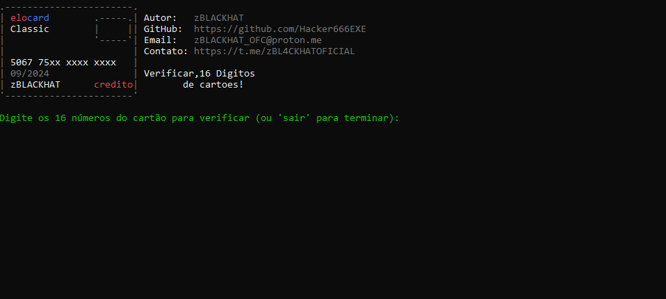

# Verificador de Cartões de Crédito

Este script valida números de cartões de crédito e identifica seu tipo com base nos 16 dígitos fornecidos.

## Funcionalidades

- **Validação de Cartões**: Verifica se o número do cartão é válido usando o algoritmo de Luhn.
- **Identificação do Tipo de Cartão**: Detecta se o cartão é Visa, Mastercard, American Express.

## Como Usar

1. **Clone o Repositório**

   ```bash
   git clone https://github.com/Hacker666EXE/CheckerLuhnPY
   
 